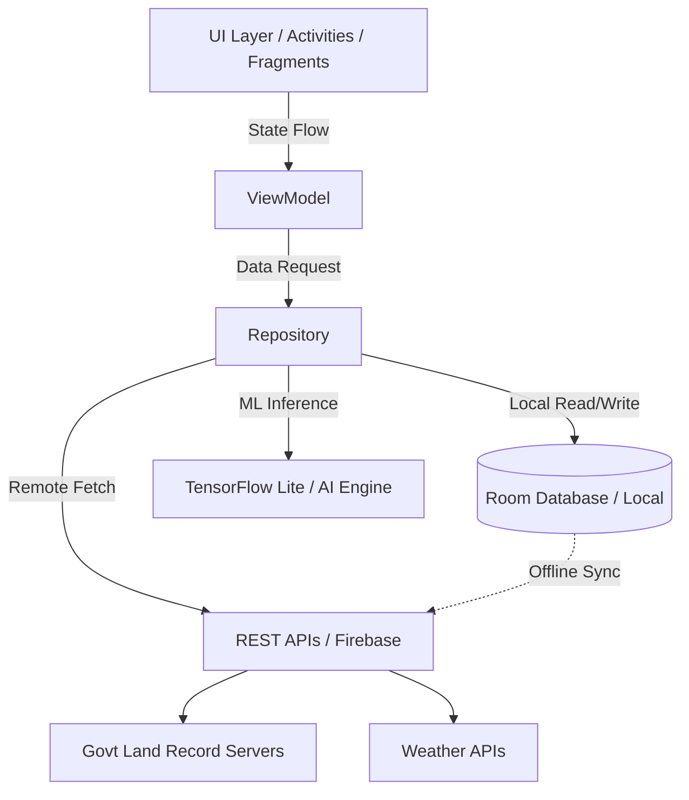

<div align="center">
  

  # EPeekPahani 🌱
  **Empowering Farmers with Transparent, Digital Agricultural Workflows & Smart Land Records.**

  [](https://kotlinlang.org)
  [](https://android.com)
  [](https://opensource.org/licenses/MIT)
  [](#)
  [](#)
</div>

---

## 📖 About EPeekPahani

"Peek Pahani" traditionally refers to the manual inspection and recording of crops cultivated on a piece of agricultural land by government revenue officials. **EPeekPahani** is the digital transformation of this crucial agricultural land record system. 

It acts as a digital bridge between farmers and the administration. By digitizing crop registration and land records, EPeekPahani empowers farmers to self-report their crop data directly from their fields. This eliminates bureaucratic delays, enhances transparency, and ensures that government subsidies, insurance claims, and disaster relief can be dispersed accurately and efficiently based on verified digital footprints.

## ⚠️ Problem Statement

Historically, agricultural records and rural documentation have been plagued by significant inefficiencies:
* **Manual Data Entry:** Revenue officers manually registering crop data across thousands of acres, leading to inevitable human errors and outdated records.
* **Farmer Difficulties:** Farmers facing long wait times, dependency on officers, and lack of direct access to their own land records.
* **Corruption & Delays:** Lack of centralized, transparent digital workflows creating bottlenecks in disaster relief distribution and crop insurance processing.
* **Data Silos:** Government bodies operating on fragmented, paper-based records, making macro-level agricultural planning nearly impossible.

## 💡 Solution Overview

EPeekPahani modernizes the entire ecosystem by putting the power of digital governance directly into the farmer's hands:
* **Self-Reporting:** Farmers can upload geotagged photos of their crops, instantly updating central land records.
* **Transparent Workflows:** A clear, traceable path for every crop registration, reducing corruption and administrative friction.
* **Smart Assistance:** Integrating AI-driven insights to help farmers make data-backed decisions based on localized weather and crop conditions.
* **Digital Governance:** Providing administrators with a centralized, real-time dashboard of agricultural activity across regions.

## ✨ Core Features

| Feature | Description |
| :--- | :--- |
| 🧑‍🌾 **Farmer Profile System** | Secure, KYC-integrated profiles linking farmers to their designated land parcels. |
| 📄 **Land Record Management** | Digital 7/12 (Satbara) extracts and Khata (Account) integrations for instant verification. |
| 📷 **OCR Document Scanning** | Automated extraction of details from old paper records and ID proofs. |
| 🤖 **AI-Powered Assistance** | Smart advisory system recommending crop rotations and predicting pest threats. |
| 📊 **Smart Dashboards** | Intuitive visual analytics showing farm yield history and crop distribution. |
| 📍 **Geo-location & Geofencing** | Validates crop photo uploads by cross-referencing GPS coordinates with land boundaries. |
| 📶 **Offline-First Support** | Critical workflows function without internet, syncing automatically when connectivity returns. |
| 🔔 **Notification System** | Alerts for extreme weather, government schemes, and crop survey deadlines. |
| 🌍 **Multilingual Support** | Fully localized interfaces supporting regional languages (Marathi, Hindi, English). |
| 🔒 **Secure Digital Records** | End-to-end encrypted storage to protect sensitive land ownership data. |

## 🛠️ Tech Stack

### Mobile & Core
| Technology | Usage |
| :--- | :--- |
| **Android** | Native OS platform targeting broad accessibility |
| **Kotlin** | Primary programming language (Coroutines, Flow) |
| **Gradle** | Build system & dependency management |

### AI & Data Storage
| Technology | Usage |
| :--- | :--- |
| **TensorFlow Lite** | On-device ML for crop disease detection & OCR |
| **SQLite / RoomDB** | Robust local database for offline-first capabilities |
| **Firebase** | Authentication, Crashlytics, and real-time backend sync |

### Services & APIs
| Technology | Usage |
| :--- | :--- |
| **Google Maps API** | Plotting land boundaries and geofencing |
| **Location Services** | High-accuracy GPS verification for crop images |
| **OpenWeather API** | Real-time agro-meteorological updates |

## 🏗️ Architecture

EPeekPahani follows a modern, scalable MVVM (Model-View-ViewModel) architecture tailored for robust Android development.



## 📂 Folder Structure

```text
EPeekPahani/
├── app/
│   ├── src/
│   │   ├── main/
│   │   │   ├── java/com/shambhavi/epeekpahani/
│   │   │   │   ├── ui/          # Activities, Fragments, Compose screens
│   │   │   │   ├── viewmodel/   # Business logic and state management
│   │   │   │   ├── model/       # Data classes and entities
│   │   │   │   ├── repository/  # Single source of truth for data
│   │   │   │   ├── network/     # Retrofit clients, API services
│   │   │   │   ├── database/    # Room DAOs and DB configurations
│   │   │   │   ├── ai/          # TFLite wrappers and inference logic
│   │   │   │   └── utils/       # Helpers, constants, and extensions
│   │   │   ├── res/             # Layouts, drawables, strings, navigation
│   │   │   └── AndroidManifest.xml
│   ├── build.gradle.kts
│   └── proguard-rules.pro
├── gradle/                      # Gradle wrapper configuration
├── local.properties             # SDK path and local secrets (Git-ignored)
├── build.gradle.kts             # Project-level build script
└── README.md
```

## 🚀 Installation & Setup Guide

### 1. Clone the Repository
```powershell
git clone https://github.com/Shambhavi500/EPeekPahani.git
cd EPeekPahani
```

### 2. Android Studio Setup
* Open **Android Studio**.
* Select **Open an existing project** and point it to the cloned `EPeekPahani` directory.
* Ensure your IDE is configured to use **JDK 21** or later.

### 3. Local Properties Setup
Create a `local.properties` file in the root directory (if not automatically generated) to define your SDK path:
```properties
sdk.dir=C\:\\Users\\YourUsername\\AppData\\Local\\Android\\Sdk
# Add API keys here if required
MAPS_API_KEY="your_api_key_here"
```

### 4. Gradle Build
Let Android Studio sync the project dependencies. Alternatively, run in PowerShell:
```powershell
.\gradlew.bat clean build
```

### 5. Running the App
* **Emulator:** Launch an AVD (Android Virtual Device) via the AVD Manager.
* **Physical Device:** Connect via USB and enable USB Debugging.
* Build and deploy:
```powershell
.\gradlew.bat assembleDebug
.\gradlew.bat installDebug
```

## 🖥️ Environment Requirements
* **OS:** Windows 10/11, macOS, or Linux
* **RAM:** 8 GB minimum (16 GB recommended for Android Studio + Emulator)
* **Android Studio:** Ladybug (or latest stable)
* **Android SDK:** API 34 (Minimum SDK API 24)
* **Java Version:** JDK 21

## 📦 Application Modules

1. **Authentication:** Secure OTP-based login tailored for rural users, linked to Aadhaar/farmer IDs.
2. **Dashboard:** Central hub summarizing crop status, local weather, and pending tasks.
3. **Farmer Data:** Profile management containing personal info, land holdings, and banking details for subsidies.
4. **Land Records:** Integration with local land registries (like 7/12) to visualize owned plots.
5. **AI Recommendations:** Inference module analyzing soil, weather, and crop data to provide actionable advice.
6. **Analytics:** Visual tracking of yield trends and expense management.
7. **Settings:** Localization, notification preferences, and sync configurations.
8. **Admin Controls:** (Role-based) Tools for officials to verify uploads and resolve disputes.

## 🧠 AI & Smart Agriculture

EPeekPahani goes beyond standard record-keeping by acting as an intelligent farming assistant:
* **Disease Detection:** On-device image processing to diagnose leaf blights and pest attacks.
* **Crop Recommendation:** Algorithms suggesting optimal crops based on historical yield data and current soil moisture.
* **Predictive Analytics:** Forecasting harvest timelines and potential yield based on weather patterns.

## 🛡️ Security & Privacy
* **End-to-End Encryption:** Sensitive land and banking details are encrypted both in transit and at rest.
* **Secure APIs:** All communication with external and government servers uses TLS 1.3 and JWT tokens.
* **Granular Permissions:** The app requests camera and location permissions strictly during the crop registration flow.
* **Data Integrity:** Geotags and timestamps on images are digitally signed to prevent spoofing.

## 🔮 Future Scope
* **Blockchain Land Records:** Immutable, transparent ledgers for land ownership and transfer histories.
* **Satellite & Drone Integration:** Using automated aerial imagery to verify crop health at a macro scale.
* **IoT Sensor Integration:** Real-time sync with field sensors for soil pH, moisture, and temperature.
* **Predictive Market Pricing:** AI advising farmers on optimal times to sell crops based on market forecasting.

## 🚧 Development Challenges
During development (especially in high-pressure hackathon environments), the team navigated:
* **Offline Synchronization:** Building robust Room database logic that safely caches data and resolves conflicts upon reconnection.
* **Geofencing Accuracy:** Handling GPS jitter and ensuring accurate location verification for rural plots.
* **AI Model Optimization:** Compressing TensorFlow models to run efficiently on low-end smartphones.
* **Gradle & JDK Compatibility:** Resolving build toolchain updates and ensuring consistent compilation environments.

## 👥 Contributors
| Name | Role | GitHub |
| :--- | :--- | :--- |
| **Shambhavi Patil** | Lead Developer | [@Shambhavi500](https://github.com/Shambhavi500) |
| *Open to Contributions!* | | |

## 🔄 Git Workflow
We follow a structured trunk-based development workflow:
* **`main`:** Stable, production-ready code.
* **Feature Branches:** Created for new modules (e.g., `feature/ai-integration`).
* **Commits:** Descriptive messages following Conventional Commits.
* **Pull Requests:** Require code review and successful CI/Gradle checks before merging.

## 📸 Demo & Screenshots

> *Note: Placeholders for project media. Add images to a `/docs/assets` folder.*

| Dashboard | Crop Registration | AI Analysis |
| :---: | :---: | :---: |
|  |  |  |

**[▶️ Watch Demo Presentation Video Here](#)**  
**[⬇️ Download Latest APK Here](#)**

## 📄 License
This project is licensed under the MIT License - see the [LICENSE](LICENSE) file for details.

## 🙏 Acknowledgements
* Inspired by the urgent need for **agricultural digitization** and transparent governance.
* Built during competitive **Hackathon environments** driving rural technology innovation.
* Special thanks to open-source communities for Android, Kotlin, and machine learning tools making modern AgriTech accessible.

---
<div align="center">
  <i>Digitizing agriculture, one farm at a time. 🌾</i>
</div>
